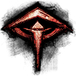

# GW2 Builds

## Necromancer

* **Power MM Reaper (Blood/Death):**  
[&DQgTPQIVIjWbAJsAcAFwAXYAdgAPEw8TlQCVAAAAAAAAAAAAAAAAAAAAAAA=]
* **Power Reaper (Blood/Spite):**  
[&DQgTPTUpIj3BEsESphKmEvES8RIPEw8TAxMDEwAAAAAAAAAAAAAAAAAAAAA=]
* **Power Reaper (Spite/SR):**  
[&DQg1KTImIj3BEsESphKmEvES8RIPEw8TAxMDEwAAAAAAAAAAAAAAAAAAAAA=]
* **Power Reaper (Blood/SR):**  
[&DQgTPjImIj3BEsES6xLrEvoA+gC9Ab0BAxMDEwAAAAAAAAAAAAAAAAAAAAA=]
----

* **Condition MM Scourge (Blood/Death):**  
[&DQgTPQIlPCWbAJsAcAFwAXYAdgByFr0BlQCVAAAAAAAAAAAAAAAAAAAAAAA=]
* **Condition Scourge (Parasitic Curses/SR):**  
[&DQgnLTI+PCl+Fn4WJBckFyEXcwFyFr0BYBdgFwAAAAAAAAAAAAAAAAAAAAA=]
* **Condition Scourge (Blood/SR):**  
[&DQgTPjI+PCl+Fn4WgQAkF3MBgQByFr0BYBdgFwAAAAAAAAAAAAAAAAAAAAA=]
* **Condition Scourge (Lingering Curses/SR):**  
[&DQgnPTI+PCl+Fn4WJBckFyEXcwFyFr0BYBdgFwAAAAAAAAAAAAAAAAAAAAA=]  
  [Details](http://gw2skills.net/editor/?PS1As+ZlN0wgYShsn8mZmW6X+vUA-zRZYVKiGaxUpjGgoLSCKElRBpaZVlwzCM7AA-e)

## Guardian

* **Power Dragonhunter:**  
[&DQEQPioaGzsmDyYPSAF4ATYBNgH+AP4AtRKJEgAAAAAAAAAAAAAAAAAAAAA=]
* **Power Firebrand:**  
[&DQEQPSobPjpLF0sXSAFIATYBNgH+AP4AiRKJEgAAAAAAAAAAAAAAAAAAAAA=]

## Ranger

* **Power Ranger:**  
[&DQQIOh42IBt5AHkApQGlAbsAuwCsAawB7QDtADkuFSgAAAAAAAAAAAAAAAA=]
* **Power Soulbeast (Marksman):**  
[&DQQILiArNzp5AHkApQGlAbsAuwCsAawB7QDtADsuFSgAAAAAAAAAAAAAAAA=]
* **Power Soulbeast (Survivor):**  
[&DQQhLSArNzd5AHkApQGlAbsAuwCWAZYB7QDtADsuFSgAAAAAAAAAAAAAAAA=]

## Engineer

* **Hybrid Scrapper:**  
[&DQMmHx09Kx/ZEtkSrhKuEicTJxOTAZUBgxKDEgAAAAAAAAAAAAAAAAAAAAA=]  
  [Details](http://gw2skills.net/editor/?PekAIRlRwgYNsO2JW+S9tPA-zRRYVKqD6TMpqEDsQokALLSioI0YW+dYD-e)
* **Hybrid Holosmith:**  
[&DQMmPxU5ORsqDyoP5RblFmABYAGIAIgA+RKJAQAAAAAAAAAAAAAAAAAAAAA=]  
  [Details_Swiftness++](http://gw2skills.net/editor/?Pe0Aw6RlJkwoiagBOxEXalW+X5vNA-zRRYVKqD6TMprEDsQokALLVioK0YW+dYD-e)
  [Details_Might++](http://gw2skills.net/editor/?Pe0Aw6RlJkwoiagBOxEXalW+X5vNA-zRRYVKqD6TMprEDsUokALLUCMBioK0YW+dYD-e)

## Elementalist

* **Power/Hybrid Tempest:**  
[&DQYfGSkpMDvHEscSwxLDEqUSpRLLAMsAJgCZEgAAAAAAAAAAAAAAAAAAAAA=]
* **Power/Hybrid Weaver:**  
[&DQYfNSUbOD90AHQANRc1F/UVcwDLAMsAJgASFwAAAAAAAAAAAAAAAAAAAAA=] 

## Thief

* **Power Daredevil (--Signets):**  
[&DQUsKyM5BzUKAQoBsBIZAVsBWwG2EikT7hIoAAAAAAAAAAAAAAAAAAAAAAA=]
* **Power Daredevil (Signets++):**  
[&DQUsKyM6BzWFAIUAVwFXAVsBWwG2EikT7hIoAAAAAAAAAAAAAAAAAAAAAAA=]
* **Power Deadeye:**  
[&DQUsGyM/OimFAIUAVwFXAVsBWwHkFiAXKAAoAAAAAAAAAAAAAAAAAAAAAAA=]

## Revenant

* **Power Herald (Glint Jalis):**  
[&DQkDPw85NCXcEdwR1BHUEQYSBhIrEisSyhHKEQMBAQPUEQYSKxLUEQYSKxI=]
* **Power Renegade (Shiro Jalis):**  
[&DQkDPw8/PyncEdwR1BHUEQYSBhIrEisSyhHKEQIDAgPUEQYSKxLUEQYSKxI=]
* **Power Renegade (Shiro Kalla):**  
[&DQkDPw8/PyncEdwRKxLUEdQRBhIGEisSyhHKEQUCAwLUEQYSKxLUEQYSKxI=]

## Mesmer

* **Power Chronomancer:**  
[&DQcYGgEdKDojDyMPjwGPAWsBawEEE4YBsxKaAQAAAAAAAAAAAAAAAAAAAAA=]
* **Power Mirage:**  
[&DQcKGQEdOxkjDyMPjwGPAQcWBxbgFYYBRheaAQAAAAAAAAAAAAAAAAAAAAA=]

## Warrior

* **Power Warrior:**  
[&DQIEKzMeCymnAKcAqACoAGoAagCtAK0AfAGcAAAAAAAAAAAAAAAAAAAAAAA=]
* **Power Berserker:**  
[&DQIEKzMeEhfyEvISqACoANcS1xKtAK0AwhKcAAAAAAAAAAAAAAAAAAAAAAA=]
* **Power Spellbreaker:**  
[&DQIEKzMePT1wAHAAqACoAGoAagCtAK0AfAGcAAAAAAAAAAAAAAAAAAAAAAA=]

# EoD Beta Builds

## Necromancer

* **Power Harbinger:**  
[&DQgTPTIqQBYoDygP1BrUGtca1xrsGuwa6BroGgAAAAAAAAAAAAAAAAAAAAA=]
* **Condition Harbinger:**  
[--]

## Guardian

* **Power Willbender:**  
[&DQEQPio6QSrjGiYP3hpIAeEaNgHYGv4A6Ro3AQAAAAAAAAAAAAAAAAAAAAA=]
* **Condition Willbender:**  
[--]

## Mesmer

* **Power Virtuoso:**  
[&DQcYGgEdQikjDyMPjwGPAWsBawHfGt8a5hqaAQAAAAAAAAAAAAAAAAAAAAA=]
* **Condition Virtuoso:**  
 [--]
 